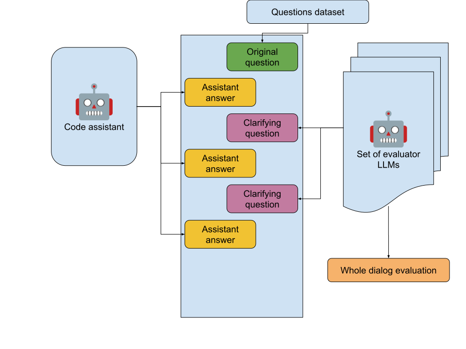

# Evaluation framework for chat scenario in code assistant LLMs

Natural language chat is one of the main scenarios for using a code assistant like Github Copilot or Amazon Q Developer. You ask its questions, assistant give you answers and snippets of code, you asks clarifying questions and so on and so forth.

But unfortunately so far nobody created a valid public validation system for such types of scenarios.

This repository is an attempt to tackle this problem.

## Main problems with code assistant chat evaluations

1. Chat scenario assume multi-turn conversation, it means that evaluation framework should allow for that. But it means that we need to evaluate each step of a conversation and in turn it means that we cannot depend on pre-canned conversations - because the first answer of an evaluated model will move conversation in an unexpected way.
2. Users can chat with code assistant with multiple intents. Sometimes the goal of the user will be to get a working code, sometimes some explanation, sometimes both. Also context of the conversation may be very different, sometimes it will be about repository with a lot of established unit tests, sometimes it will be just general question. It means that we cannot depend on only unit tests and code execution in our evaluation, we need to evaluate model answers holistically from different angles.

## Current evaluation framework

Idea of this evaluation framework is to use different LLMs to evaluate a chat conversation on every step until evaluators decide that code assistant either answered original question correctly and completely or we exhaust predefined number of steps in the conversation.

Idea that for an individual evaluation we start with a question that we ask evaluated code assistant. Then we get code assistant answer and ask another LLM to evaluate this answer by several criteria. If evaluator LLM is satisfied with the answer than we stop the conversation. Otherwise we ask evaluator LLM to generate a follow-up question and pass it to an original conversation with code assistant and then repeat evaluation process until evaluator is satisfied with the the result of the conversation.

Of course instead of one evaluator we can use several ones and combine their output together.

### Pros and cons

- ++ All we need to run evaluation in this scenario is a set of predefined questions and one or several evaluator models. We don't need to generate any gold answers.
- ++ Framework will test fully multi-turn chat scenario where all the intermediate answers are produced by evaluated model itself and are not taken from predefined dataset.
- ++ Framework is easily exetnsible to different code assistant chat scenarios - be it general questions or repo specific questions or code explanations.
- -- All use cases require very careful picking of evaluator models together with extensive prompting. Even in a simple case in this POC most of the work went into prompt engineering and defining good evaluation criteria.
- -- Proposed framework at least in its current form does not evaluate directly correctness of source code produced by evaluated model. This is something that potentially can be added to the framework for specific use cases, but it will require additional considerations.

## Implementation details

### Data

For this proof-of-concept to simplify things we are focusing on the scenario where users asks code assistant general knowledge coding question, that does not require access to a specific code repository for answering.

To get such questions we use publicly available StackOverflow dataset.
https://www.kaggle.com/datasets/stackoverflow/stackoverflow

From this dataset we extract a set of 200 unanswered Python questions. This questions will be used as initial questions for our evaluations.

### Evaluators

Evaluators are carefully prompted LLMs that we ask to evaluate code assistant answer by three criteria:
- Understanding - did code assistant understood the question correctly and provide answer that solves initial question
- Correctness - did code assistant solved the problem correctly and without errors
- Completeness - is proposed solution full and complete or are there anything that need to be added to the assistant's answer?

Evaluator is also prompted to provide a follow-up question to code assistant in case it needed.

Experiments shown that at least for current scenario (answering SO questions) best prompting is to ask evaluator to assume a senior engineering mentor persona who is mentoring an intern in his team.

All evaluator prompts can be found in [prompt_files](src/mt_chat_code_eval/prompt_files) folder.

### Evaluating evaluators

Crucial piece of this evaluation framework is that we need to trust our evaluator models. In order to test this we also created an validation mechanism to check how well different models are performing an evaluation task.

To do this we extracted separate test of questions from the StackOverflow dataset, in this case with answers. For each answer we label them as positive and negative. Positive answer is an accepted answer with high positive user score, negative answer is not an accepted answer with negative user score.

Assumption for validation is that evaluator presented with a question and positive answer should evaluate it as complete, and presented with negative answer should evaluate it as not satisfactory by one or several criteria.

|                   | Positive      | Positive    | Positive     | Positive     | Negative      | Negative    | Negative     | Negative     |
| ----------------- | ------------- | ----------- | ------------ | ------------ | ------------- | ----------- | ------------ | ------------ |
|                   | Understanding | Correctness | Completeness | All criteria | Understanding | Correctness | Completeness | All criteria |
| **gpt-4o-2024-08-06** | 96.00%        | 87.00%      | 70.00%       | **69.00%**       | 44.00%        | 26.00%      | 9.00%        | **9.00%**        |
| gpt-4o-2024-05-13 | 100.00%       | 93.00%      | 56.00%       | 56.00%       | 52.00%        | 29.00%      | 4.00%        | 4.00%        |
| gemini-1.5-pro    | 95.00%        | 80.00%      | 48.00%       | 47.00%       | 41.00%        | 25.00%      | 3.00%        | 3.00%        |
| gpt-4o-mini       | 76.00%        | 48.00%      | 5.00%        | 2.00%        | 19.00%        | 8.00%       | 0.00%        | 0.00%        |
| gemini-1.5-flash  | 95.00%        | 70.00%      | 34.00%       | 34.00%       | 48.00%        | 18.00%      | 4.00%        | 4.00%        |

For this proof-of-concept gpt-4o-2024-08-06 was chosen as a sole evaluator, because it provides a good balance between accepting correct answers (69% of the cases) and not accepting wrong once (91% of the cases).
But framework itself allows using any number of evaluators together and it definitely a future to-do item to choose a best combination.

All validations results can be found in validation_results folder.

### Example chats

Some example chats can be found in examples folder:

- [examples/incomplete-answer.txt](examples/incomplete-answer.txt) - example of a chat where model provided incomplete and truncated answer (probably due to model restriction) and evaluator noticed both of the problems and asked to correct them both.
- [examples/evaluator-assessment.txt](examples/evaluator-assessment.txt) - example of a evaluator assessment of a complete conversation from the previous example.
- [examples/one-step-conversation.txt](examples/one-step-conversation.txt) - example of a conversation completed in one step where code assistant model produced correct result straight away
- [examples/wrong-language.txt](examples/one-step-conversation.txt) - example where code assistant start answering a question in wrong programming language (because language was nt mentioned in the original question) but evaluator noticed that (because evaluator is prompted that conversations should be about Python)

## Evaluation results

Due to a limited resources of this POC only handful of models were evaluated.

All evaluation results can be found in evaluation_results folder.

## Future work and improvements

### Better evaluation data

The dataset used for this POC have two problems:
1. It latest data is from 2022, so whatever questions there are, they are already long answered on the website and definitely were in a training data of all modern LLMs.
The same apply to the validation data used to choose evaluators.
2. StackOverflow problems in general, especially chosen randomly are too simple for most of the modern LLM system. Evaluation results are mainly differ in number of steps required to reach a solution, but most LLMs answer correctly 100% of the questions in the evaluation dataset.

Ways to mitigate these problems:
1. More up-to-date StackOverflow data is available at https://archive.org/download/stackexchange. This dataset is regularly updated unlike the ne in the BigQuery. So it will provide much fresher set of questions, that will not be in LLMs training data already.
2. Questions should be much more thoughtfully validated in order to be included into evaluation set. Probably some combination of automated and human validation will be needed.

### Better evaluator models

As was already mentioned more thoughtful validation of evaluators is needed to choose the most suitable one.

In addition prompting for evaluators may be improved signifcantly as well. 

Another area to explore is actually splitting evaluation process into several steps - independently evaluating existing answers and independently generating follow-up questions. For example by causal observation it seems that evaluator model sometimes does not evaluate a correct answer as complete by asking more general fllow-up question instead of a clarifying one.

### Other use cases and evaluations

The general framework should be easily applicable for evaluation of other use cases. For example dataset can be created from an open issues of an open source repositories and we can evaluate a code assistant ability to solve specific issues in code.

Other most probable extension will be to add code testing to the evaluation step, to not only trust evaluator model but to actually check that code portin of the answer is correct and executable. 